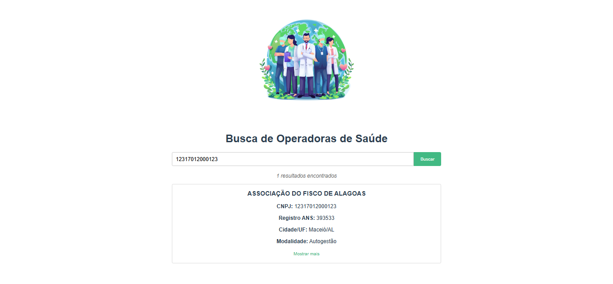
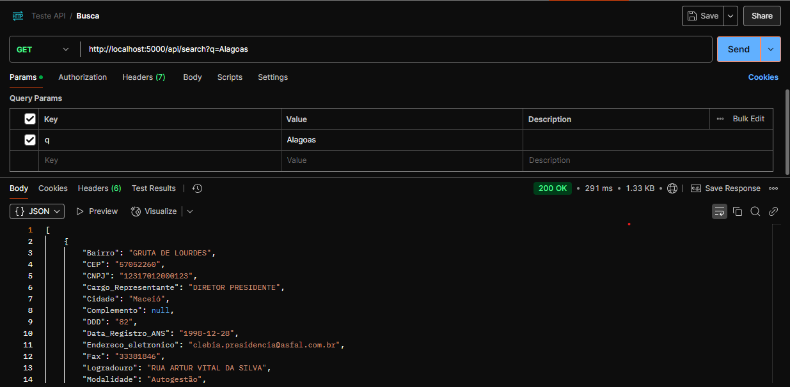
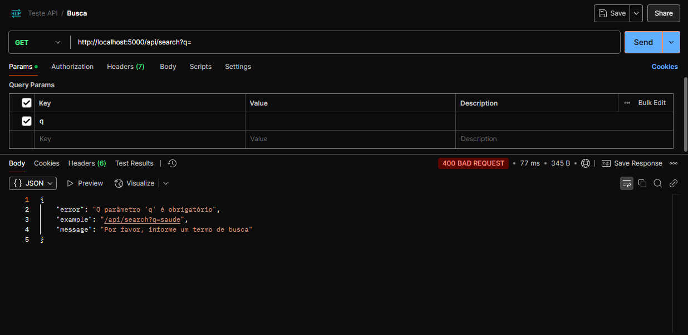

# Teste de API para Consulta de Operadoras ANS




## 📋 Pré-requisitos

- Python 3.8+
- Node.js 16+
- Arquivo Relatorio_cadop.csv na pasta /backend/data

## 🛠️ Instalação

1. Backend (Python/Flask)

```bash
  cd backend
  python -m venv venv
  source venv/bin/activate  # Linux/Mac
  venv\Scripts\activate    # Windows
  pip install -r requirements.txt
```

2. Frontend (Vue.js)

```bash
  cd frontend
  npm install
```

## Configuração

- Crie o arquivo .env na pasta backend:

```bash
  FLASK_APP=app.py
  FLASK_ENV=development
```

## 🗃️ Estrutura do Projeto

operadoras-ans-api/</br>
├── backend/</br>
│ ├── app.py &nbsp;&nbsp;&nbsp;&nbsp;&nbsp;&nbsp;&nbsp;&nbsp;&nbsp;&nbsp;&nbsp;&nbsp;&nbsp;&nbsp;&nbsp;&nbsp;&nbsp;&nbsp;&nbsp;&nbsp;&nbsp;&nbsp;&nbsp;&nbsp;&nbsp;&nbsp;&nbsp;&nbsp;&nbsp;&nbsp;&nbsp;&nbsp;&nbsp;&nbsp;&nbsp;&nbsp;# API principal</br>
│ ├── requirements.txt &nbsp;&nbsp;&nbsp;&nbsp;&nbsp;&nbsp;&nbsp;&nbsp;&nbsp;&nbsp;&nbsp;&nbsp;&nbsp;&nbsp;&nbsp;&nbsp;&nbsp;&nbsp;&nbsp;&nbsp;&nbsp;# Dependências Python</br>
│ └── data/</br>
│ └── Relatorio_cadop.csv &nbsp;&nbsp;&nbsp;&nbsp;&nbsp;&nbsp;&nbsp;&nbsp;&nbsp;&nbsp;&nbsp;&nbsp;&nbsp;&nbsp;&nbsp;&nbsp;# Dados das operadoras</br>
│</br>
├── frontend/</br>
│ ├── public/&nbsp;&nbsp;&nbsp;&nbsp;&nbsp;&nbsp;&nbsp;&nbsp;&nbsp;&nbsp;&nbsp;&nbsp;&nbsp;&nbsp;&nbsp;&nbsp;&nbsp;&nbsp;&nbsp;&nbsp;&nbsp;&nbsp;&nbsp;&nbsp;&nbsp;&nbsp;&nbsp;&nbsp;&nbsp;&nbsp;&nbsp;&nbsp;&nbsp;&nbsp;&nbsp;&nbsp;&nbsp;&nbsp;# Assets estáticos</br>
│ ├── src/</br>
│ │ ├── components/ &nbsp;&nbsp;&nbsp;&nbsp;&nbsp;&nbsp;&nbsp;&nbsp;&nbsp;&nbsp;&nbsp;&nbsp;&nbsp;&nbsp;&nbsp;&nbsp;&nbsp;&nbsp;&nbsp;&nbsp;&nbsp;&nbsp;&nbsp;&nbsp;# Componentes Vue</br>
│ │ ├── views/ &nbsp;&nbsp;&nbsp;&nbsp;&nbsp;&nbsp;&nbsp;&nbsp;&nbsp;&nbsp;&nbsp;&nbsp;&nbsp;&nbsp;&nbsp;&nbsp;&nbsp;&nbsp;&nbsp;&nbsp;&nbsp;&nbsp;&nbsp;&nbsp;&nbsp;&nbsp;&nbsp;&nbsp;&nbsp;&nbsp;&nbsp;&nbsp;&nbsp;&nbsp;&nbsp;&nbsp;# Páginas</br>
│ │ └── App.vue&nbsp;&nbsp;&nbsp;&nbsp;&nbsp;&nbsp;&nbsp;&nbsp;&nbsp;&nbsp;&nbsp;&nbsp;&nbsp;&nbsp;&nbsp;&nbsp;&nbsp;&nbsp;&nbsp;&nbsp;&nbsp;&nbsp;&nbsp;&nbsp; &nbsp;&nbsp;&nbsp;&nbsp;&nbsp;&nbsp;&nbsp;&nbsp;# Componente principal</br>
│ └── package.json&nbsp;&nbsp;&nbsp;&nbsp;&nbsp;&nbsp;&nbsp;&nbsp;&nbsp;&nbsp;&nbsp;&nbsp;&nbsp;&nbsp;&nbsp;&nbsp;&nbsp;&nbsp;&nbsp;&nbsp;&nbsp;&nbsp;&nbsp;&nbsp;&nbsp;&nbsp;&nbsp;&nbsp; # Dependências Node</br>
│</br>
├── documentation/</br>
│ ├── postman_collection.json&nbsp;&nbsp;&nbsp;&nbsp;&nbsp;&nbsp;&nbsp;&nbsp;&nbsp;&nbsp;&nbsp;&nbsp; # Coleção Postman</br>
│</br>
├── .gitignore</br>
└── README.md</br>

## 🚀 Execução

1. Inicie o servidor backend:

```bash
  cd backend
  flask run --port 5000
```

2. Inicie o frontend:

```bash
  cd frontend
  npm run serve
```

3. Acesse a aplicação em:

```bash
  http://localhost:8080
```

## 📊 Rotas da API

Método&nbsp;&nbsp;&nbsp;&nbsp;&nbsp;&nbsp;&nbsp;&nbsp;&nbsp;&nbsp; Endpoint&nbsp;&nbsp;&nbsp;&nbsp;&nbsp;&nbsp;&nbsp;&nbsp;&nbsp;&nbsp;&nbsp;&nbsp;&nbsp;&nbsp;&nbsp;&nbsp;&nbsp;&nbsp;&nbsp;&nbsp; Descrição</br>
GET &nbsp;&nbsp;&nbsp;&nbsp;&nbsp;&nbsp;&nbsp;&nbsp;/api/search?q=:termo&nbsp;&nbsp;&nbsp;&nbsp;&nbsp;&nbsp;&nbsp;&nbsp; Busca textual nas operadoras

Exemplo de requisição:

```bash
  curl -X GET "http://localhost:5000/api/search?q=unimed"
```

## 📌 Exemplo de Saída

[](https://api.postman.com/collections/22880918-c6ea7b57-92f1-4ac0-b621-bdf13027de65?access_key=PMAT-01JQHSQJRYYDD9YPGRKM3Z8STP)



### Desde já agradeço a oportunidade! 🚀
